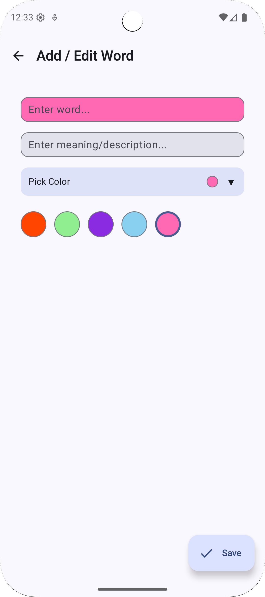

# 📚 VocabDaily

[](https://developer.android.com)
[](https://kotlinlang.org)
[](https://developer.android.com/jetpack/compose)
[](https://m3.material.io)
[](LICENSE)
[](https://android-arsenal.com/api?level=24)

A clean, modern Android vocabulary building app that helps you expand and maintain your word knowledge. Built with Jetpack Compose and following clean architecture principles, VocabDaily offers an intuitive way to add, organize, and review vocabulary words with rich descriptions and visual categorization.

## ✨ Key Highlights

- 🎨 **Modern UI**: Built entirely with Jetpack Compose and Material 3 design
- 🏗️ **Clean Architecture**: Follows MVVM pattern with clear separation of concerns
- 🎯 **Offline-First**: Local storage with Room database for seamless offline experience
- 🔄 **Reactive**: Uses Kotlin Flow for reactive data streams
- 🎨 **Customizable**: Color-coded word cards for visual organization
- ⚡ **Performance**: Optimized with Hilt dependency injection

## Features
- Add, edit, and delete words with descriptions.
- Color‑coded word cards with high‑contrast text for readability.
- Sorting by `Word`, `Date`, or `Color` with `Ascending`/`Descending` options.
- Undo delete via Snackbar action.
- Material 3 design, rounded cards, and friendly UX.

## Tech Stack
- Kotlin, Coroutines, Flow
- Jetpack Compose (Material 3)
- Room (SQLite) for local persistence
- Hilt for dependency injection
- Navigation‑Compose
- Gradle Kotlin DSL

## Architecture
Follows a layered, clean architecture with clear separation of concerns.

- Domain
  - `model/Word.kt`: Entity representing a vocabulary word.
  - `repository/WordRepository.kt`: Abstraction for data operations.
  - `use_case/`: Business logic (Add, Delete, Get, GetAll, etc.).
  - `utils/`: Ordering and sorting models.
- Data
  - `data_source/WordDao.kt`: Room DAO for CRUD operations.
  - `data_source/WordDatabase.kt`: Room database configuration.
  - `repository/WordRepositoryImpl.kt`: Implementation of domain repository.
- Presentation
  - `words/WordsViewModel.kt`: MVVM state holder using `WordsState` and `WordsEvent`.
  - `words/component/WordsScreen.kt`: Main screen with sorting and list rendering.
  - `words/component/WordItem.kt`: Word card composable.
  - `add_edit_words/*`: Add/Edit word flow.
- DI
  - `di/AppModule.kt`: Hilt bindings and providers.
- App
  - `WordApp.kt`: Application class for Hilt.

## Project Structure
```
app/src/main/java/com/example/vocabdaily/
├── WordApp.kt
├── data/
│   ├── data_source/
│   │   ├── WordDao.kt
│   │   └── WordDatabase.kt
│   └── repository/
│       └── WordRepositoryImpl.kt
├── di/
│   └── AppModule.kt
├── domain/
│   ├── model/Word.kt
│   ├── repository/WordRepository.kt
│   ├── use_case/
│   │   ├── AddWordUseCase.kt
│   │   ├── DeleteWordUseCase.kt
│   │   ├── GetWordUseCase.kt
│   │   ├── GetWordsUseCase.kt
│   │   └── WordUseCases.kt
│   └── utils/
│       ├── OrderType.kt
│       └── WordOrder.kt
└── presentation/
    ├── MainActivity.kt
    ├── routes/Screen.kt
    ├── words/
    │   ├── WordsEvent.kt
    │   ├── WordsState.kt
    │   ├── WordsViewModel.kt
    │   └── component/
    │       ├── DefaultRadioButton.kt
    │       ├── WordItem.kt
    │       └── WordsScreen.kt
    └── add_edit_words/
        ├── AddEditWordEvent.kt
        ├── AddEditWordViewModel.kt
        ├── WordsTextFieldState.kt
        └── component/
```

## 🚀 Getting Started

### Prerequisites

Before you begin, ensure you have the following installed:

- **Android Studio**: Giraffe (2022.3.1) or newer
- **JDK**: Version 11 or higher
- **Android SDK**: 
  - Minimum SDK: API 24 (Android 7.0)
  - Target SDK: API 36 (Android 14)
  - Compile SDK: API 36

### Installation

1. **Clone the repository**
   ```bash
   git clone https://github.com/yourusername/VocabDaily.git
   cd VocabDaily
   ```

2. **Open in Android Studio**
   - Launch Android Studio
   - Select "Open an existing project"
   - Navigate to the cloned directory and select it

3. **Sync dependencies**
   - Android Studio will automatically prompt to sync Gradle
   - If not, click "Sync Now" in the notification bar
   - Wait for the sync to complete

4. **Run the application**
   - Connect an Android device or start an emulator
   - Click the "Run" button (▶️) or press `Shift + F10`
   - Select your target device and click "OK"

### Build Variants

- **Debug**: For development with debugging enabled
- **Release**: Optimized build for production (requires signing configuration)

## 📖 Usage Guide

### Basic Operations

- **➕ Add Word**: Tap the floating action button to add a new vocabulary word
- **✏️ Edit Word**: Tap on any word card to edit its content
- **🗑️ Delete Word**: Use the delete button on word cards (with undo option)
- **🔄 Sort Words**: Use radio buttons to sort by Word, Date, or Color
- **🎨 Color Coding**: Select from 5 predefined color themes for visual organization

### Advanced Features

- **Undo Delete**: Accidentally deleted a word? Use the Snackbar's "Undo" action
- **Responsive Design**: Optimized for different screen sizes and orientations
- **Offline Support**: All data is stored locally - no internet required
- **Material 3**: Follows the latest Material Design guidelines

## 🏗️ Architecture Deep Dive

### Clean Architecture Layers

```
┌─────────────────────────────────────┐
│           Presentation              │
│  ┌─────────────┐ ┌─────────────┐   │
│  │   Screen    │ │  ViewModel  │   │
│  │ (Compose)   │ │   (State)   │   │
│  └─────────────┘ └─────────────┘   │
└─────────────────────────────────────┘
┌─────────────────────────────────────┐
│             Domain                  │
│  ┌─────────────┐ ┌─────────────┐   │
│  │  Use Cases  │ │ Repository  │   │
│  │ (Business)  │ │(Interface)  │   │
│  └─────────────┘ └─────────────┘   │
└─────────────────────────────────────┘
┌─────────────────────────────────────┐
│              Data                   │
│  ┌─────────────┐ ┌─────────────┐   │
│  │    Room     │ │ Repository  │   │
│  │ (Database)  │ │    (Impl)   │   │
│  └─────────────┘ └─────────────┘   │
└─────────────────────────────────────┘
```

### Key Components

#### Domain Layer
- **Word Entity**: Core data model representing a vocabulary word
- **Repository Interface**: Abstraction for data operations
- **Use Cases**: Business logic for CRUD operations
- **Utils**: Sorting and ordering utilities

#### Data Layer
- **Room Database**: Local SQLite database with DAO
- **Repository Implementation**: Concrete implementation of domain repository

#### Presentation Layer
- **ViewModels**: State holders using StateFlow and Events
- **Compose Screens**: UI components built with Jetpack Compose
- **Navigation**: Screen routing and parameter passing

### State Management

```kotlin
// Example: WordsState data class
data class WordsState(
    val words: List<Word> = emptyList(),
    val wordOrder: WordOrder = WordOrder.Date(OrderType.Descending),
    val isOrderSectionVisible: Boolean = false
)

// Example: WordsEvent sealed class
sealed class WordsEvent {
    data class Order(val wordOrder: WordOrder): WordsEvent()
    data class DeleteWord(val word: Word): WordsEvent()
    object RestoreWord: WordsEvent()
    object ToggleOrderSection: WordsEvent()
}
```

## 🧪 Testing & Quality

### Current Testing Strategy
- **Unit Tests**: ViewModels and use cases leverage Kotlin Flow for reactive testing
- **Integration Tests**: Room DAO operations with in-memory database
- **UI Tests**: Compose UI testing with semantics

### Recommended Testing Additions
```kotlin
// Example: ViewModel Unit Test
@Test
fun `when delete word event, should remove word from state`() = runTest {
    // Given
    val word = Word(1, "test", "description", 123L, Color.Red.toArgb())
    
    // When
    viewModel.onEvent(WordsEvent.DeleteWord(word))
    
    // Then
    assertThat(viewModel.state.value.words).doesNotContain(word)
}
```

### Code Quality Tools
- **Ktlint**: Kotlin code formatting
- **Detekt**: Static code analysis
- **Gradle**: Dependency management and build automation

## 🤝 Contributing

We welcome contributions! Here's how you can help improve VocabDaily:

### Getting Started
1. **Fork** the repository
2. **Clone** your fork locally
3. **Create** a feature branch (`git checkout -b feature/amazing-feature`)
4. **Make** your changes
5. **Test** your changes thoroughly
6. **Commit** your changes (`git commit -m 'Add amazing feature'`)
7. **Push** to the branch (`git push origin feature/amazing-feature`)
8. **Open** a Pull Request

### Contribution Guidelines
- 📝 **Code Style**: Follow existing Kotlin conventions and use ktlint
- 🧪 **Testing**: Add tests for new features and bug fixes
- 📚 **Documentation**: Update README and code comments as needed
- 🎯 **Focus**: Keep changes focused and atomic
- 💬 **Communication**: Describe your changes clearly in PR descriptions

### Areas for Contribution
- 🐛 **Bug Fixes**: Report and fix issues
- ✨ **Features**: Add new vocabulary management features
- 🎨 **UI/UX**: Improve design and user experience
- 📱 **Accessibility**: Enhance app accessibility
- 🧪 **Testing**: Improve test coverage
- 📖 **Documentation**: Enhance documentation and examples

## 📄 License

This project is licensed under the MIT License - see the [LICENSE](LICENSE) file for details.

```
MIT License

Copyright (c) 2024 VocabDaily

Permission is hereby granted, free of charge, to any person obtaining a copy
of this software and associated documentation files (the "Software"), to deal
in the Software without restriction, including without limitation the rights
to use, copy, modify, merge, publish, distribute, sublicense, and/or sell
copies of the Software, and to permit persons to whom the Software is
furnished to do so, subject to the following conditions:

The above copyright notice and this permission notice shall be included in all
copies or substantial portions of the Software.
```

## 📞 Contact & Support

- **Issues**: [GitHub Issues](https://github.com/yourusername/VocabDaily/issues)
- **Discussions**: [GitHub Discussions](https://github.com/yourusername/VocabDaily/discussions)
- **Email**: your.email@example.com

## 🙏 Acknowledgments

- **Jetpack Compose Team**: For the amazing modern UI toolkit
- **Material Design**: For the beautiful design system
- **Android Architecture Components**: For providing robust architecture patterns
- **Open Source Community**: For inspiration and continuous learning

## 🗺️ Roadmap

### Upcoming Features
- [ ] 🔍 **Search Functionality**: Search through your vocabulary
- [ ] 📊 **Statistics**: Track learning progress and statistics
- [ ] 🔄 **Sync**: Cloud synchronization across devices
- [ ] 🎯 **Quiz Mode**: Test your vocabulary knowledge
- [ ] 🌐 **Multi-language**: Support for multiple languages
- [ ] 📱 **Widget**: Home screen widget for quick access
- [ ] 🎨 **Themes**: Custom color themes and dark mode
- [ ] 📤 **Export/Import**: Backup and restore functionality

### Version History
- **v1.0.0**: Initial release with core vocabulary management features

---

<div align="center">

**⭐ Star this repository if you find it helpful!**

Made with ❤️ using Jetpack Compose

</div>

## 📱 Screenshots

<div align="center">

### Main Features Overview

| Words List | Add/Edit Word | Color Selection |
|:----------:|:-------------:|:---------------:|
|  |  |  |
| Browse and manage your vocabulary | Add new words with descriptions | Choose from 5 color themes |

### Sorting & Organization

| Sort by Word | Sort by Date | Sort by Color |
|:------------:|:------------:|:-------------:|
|  |  |  |
| Alphabetical ordering | Chronological ordering | Color-based grouping |

</div>

> **Note**: To add screenshots, create a `docs/screenshots/` directory in your project root and place your app screenshots there. Update the image paths accordingly.

## Notes
- This project uses Material 3 and a simple clean architecture to remain easy to extend.
- If you plan to publish, consider adding a license and CI workflow (e.g., GitHub Actions) for builds.